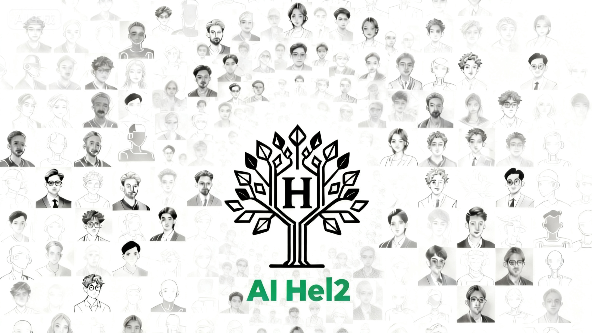
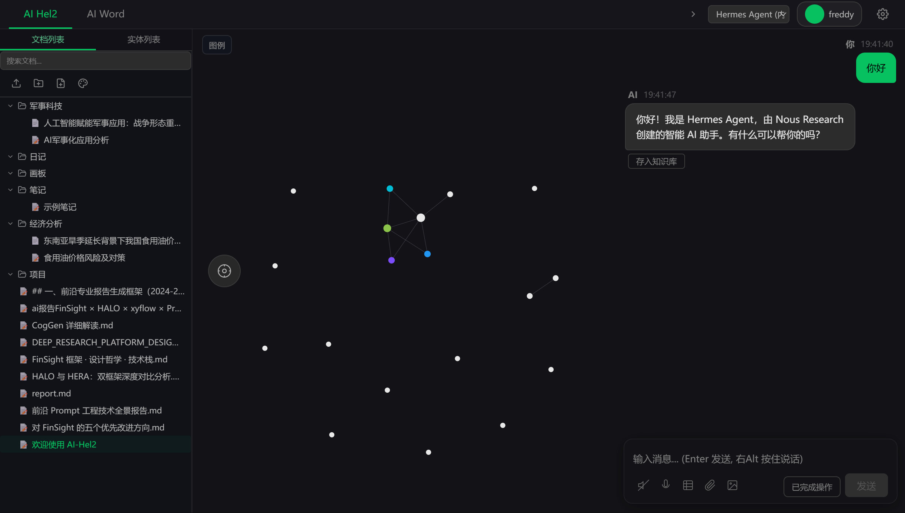

<p align="center">
  
</p>

# AI-Hel2 —— 你的伴随式智能体

> 不是另一个 AI 聊天工具。AI-Hel2 是一个**常驻桌面、持续学习、主动关联**的伴随式智能体——它在你工作时静静运行，将你的对话、文档、思考沉淀为一张不断生长的个人知识网络。

## 为什么是 AI-Hel2？

市面上的 AI 助手大多是"用完即走"的对话框：你问，它答，然后一切归零。下一次对话时，它不记得你是谁，更不知道你上次在做什么。

**AI-Hel2 的不同之处**：它在本地持续运行，每一次对话、每一篇文档、每一个想法，都被自动提取、关联、沉淀为你的**个人知识图谱**。它不是你的工具，是你的**数字同事**——越用越懂你，越用越有用。

## 三大核心能力

### 🧠 伴随式 Agent 引擎

- **常驻桌面，随时唤醒**：Alt+R 唤起对话，右 Alt 按住说话，松开发送——像跟同事说话一样自然
- **多 Agent 协作平台**：不是绑定单一模型，而是注册和管理多个 Agent，各自负责不同领域
- **工具调用 + 网页搜索**：Agent 能主动查资料、搜网页、操作知识库，不只是"聊天"
- **内嵌运行时不依赖外环境**：Hermes Agent 和 Python 运行时全部内置，安装即用

### 🔗 Nexus 知识引擎——让知识自己生长

这是 AI-Hel2 最大的特色：**你的对话和文档会自动变成结构化的知识网络**。

- **自动知识提取**：每段对话结束后，Nexus 引擎在后台通过 LLM 自动提取其中的实体、概念和关系，写入知识图谱——你不需要手动整理
- **跨文档推理**：当知识积累到一定程度，引擎会自动发现跨文档的隐藏关联——"这篇笔记里提到的方案，和三个月前那篇会议记录里的思路其实是一回事"
- **6 组智能维护**：健康检查、去重合并、文档归类、图谱分析、传递推理、冲突检测——知识库不是堆积，是生长
- **文档折叠视图**：一键从细节中抽身，看到整个知识领域的宏观结构

### 📊 知识可视化——看见你的思考

- **力导向知识图谱**：Barnes-Hut 四叉树物理引擎，节点自然分布，关联一目了然
- **对话与图谱联动**：Agent 提到某个概念，图谱自动高亮旋转到对应节点——"说到哪儿，看到哪儿"
- **全文搜索 + 实体面板**：不只是搜关键词，而是搜到知识网络中的位置和上下文

<p align="center">
  
</p>

## 与典型 AI 工具的区别

| | 普通 AI 聊天 | 笔记软件 | **AI-Hel2** |
|---|---|---|---|
| 记住上下文 | 单次对话内 | 需手动整理 | **自动沉淀到知识图谱** |
| 知识关联 | 无 | 手动双链 | **LLM 自动提取 + 推理发现** |
| 运行方式 | 打开即用，关闭即忘 | 被动记录 | **常驻桌面，持续伴随** |
| 多 Agent | 无 | 无 | **注册管理多个 Agent** |
| 数据归属 | 云端 | 本地/云端 | **完全本地，隐私自主** |
| 语音交互 | 部分支持 | 无 | **PTT 语音 + TTS 播报** |

## 技术架构

```
┌─ Tauri v2 Shell (Rust) ──────────────────────────────┐
│  窗口管理 / 系统托盘 / 全局快捷键 / 文件监听            │
├─ Frontend (React + TypeScript + Vite) ────────────────┤
│  D3-force 图谱 / Cherry Markdown / Excalidraw 画板    │
├─ Nexus Knowledge Engine (Rust + Python) ──────────────┤
│  SQLite / LLM 提取 / Barnes-Hut 物理 / 推理 / 去重    │
├─ Hermes Agent v0.15.2 (Python, 内嵌) ─────────────────┤
│  AI 对话 / 工具调用 / 网页搜索 / 知识库插件             │
└───────────────────────────────────────────────────────┘
```

## 快速开始

从 [Releases](https://github.com/fanbingqian/AI-Hel2/releases) 下载最新安装包，一键安装。

### 安装后三步走
1. 打开应用 → 注册本地账号
2. 填入大模型 API Key（DeepSeek / OpenAI / Anthropic 等均可）
3. Agent 自动启动，知识库自动初始化 → 开始对话，知识开始生长

### 系统要求
- Windows 10/11 x64
- 无需额外安装 Python 或 Git（已内置）

## 开发

### 环境准备

```bash
git clone https://github.com/fanbingqian/AI-Hel2.git
cd AI-Hel2
npm install          # 安装前端依赖
```

### 获取 Agent 运行时

Agent 源码已在 `src-tauri/hermes-agent/` 中，但嵌入式 Python 运行时未包含在仓库中（体积过大）。从 [Releases](https://github.com/fanbingqian/AI-Hel2/releases) 下载最新安装包，安装后将以下目录拷贝到源码对应位置：

```
<安装目录>/data/hermes-agent/python/  →  src-tauri/hermes-agent/python/
<安装目录>/data/hermes-agent/bash/    →  src-tauri/hermes-agent/bash/
```

> 或从 [Hermes Agent](https://github.com/NousResearch/hermes-agent) 官方仓库获取原始 Python 环境。

### 启动开发

```bash
npm run tauri dev    # 开发模式（热重载）
npm run tauri build  # 构建安装包
```

### 项目结构

```
├── src/                     # React 前端源码
├── src-tauri/
│   ├── src/                 # Rust 后端源码（Tauri 命令）
│   ├── hermes-agent/        # Python Agent 源码（不含运行时）
│   ├── icons/               # 应用图标
│   ├── migrations/          # SQLite 数据库迁移
│   └── Cargo.toml           # Rust 依赖
├── docs/                    # 设计文档
├── scripts/                 # 辅助脚本
└── assets/                  # README 图片资源
```

## License

Licensed under the Apache License, Version 2.0. See [LICENSE](LICENSE) for the full text.

Copyright 2025-2026 AI-Hel2
